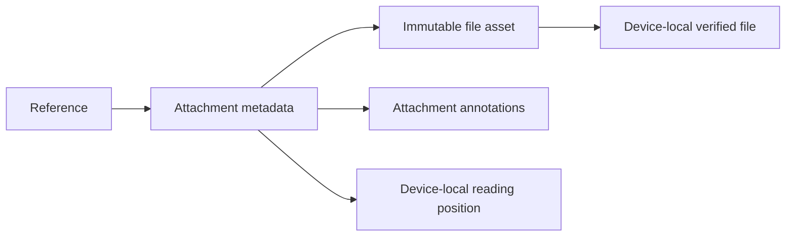

# Reference attachments — design

> Implementation order updated 2026-09-29: the user requested reader integration
> and the Details panel first, with iCloud last. The intermediate UI explicitly
> labels attachments “On this Mac.” The sync requirements below still apply before
> enabling attachment sync; they no longer gate local reader/UI development.


**Date:** 2026-09-28

**Revised:** 2026-09-29 after two independent design reviews.

**Status:** Implemented; release validation and CloudKit deployment remain pending. Attachment sync is disabled by default.

**Scope:** RubienCore, RubienSync, macOS Details and readers, CLI, and both MCP servers.

## 1. Outcome and decisions

A reference can own several supplementary PDFs and Markdown files. Users add
them in Details, open them in Rubien, annotate them, print them, and read them
on another Mac through iCloud sync.

| Decision | First version |
|---|---|
| Main document | Keep the existing PDF/web document and its default Read action. |
| Additional files | Managed copies of PDF and UTF-8 `.md` files; multi-select and file drop. |
| Content changes | File contents are immutable. A revised file is a new attachment. |
| Metadata changes | A display name can change without renaming or uploading the stored bytes. |
| Sync | New metadata, asset, and annotation records in the existing private Library zone. |
| Downloads | Automatic during sync, following the current PDF pipeline. |
| Offline use | Local additions and annotations work offline; pending changes survive restart. |
| Reading positions | Per attachment and per device; do not sync positions in this version. |
| Removal | Remove the attachment and its annotations across devices; preserve source files. |
| Cache eviction | No user-facing eviction or automatic eviction in the first version. |
| Main-document migration | No conversion of existing PDFs or web content into attachment records. |
| Attachment reader Assistant | Enabled with attachment UUID context, document-specific history, and verified attachment content. |

On-demand downloads, editable Markdown, replacement in place, manual ordering,
folder imports, and automatic collection of Markdown image files are later work.
These decisions narrow file conflicts and preserve the existing main-document path.

## 2. Existing code and constraints

- [ReferenceDetailView](../../Sources/Rubien/Views/ReferenceDetailView.swift)
  exposes one primary PDF and stored web/Markdown content, including Finder actions.
- [ReaderWindowManager](../../Sources/Rubien/Views/ReaderWindowManager.swift)
  keys windows by reference ID. Both readers load annotations by reference ID.
- [ReferencePDFRecord](../../Sources/RubienSync/ReferencePDFRecord.swift) stores
  primary PDF bytes in `CDReferencePDF.asset` as a `CKAsset`. Its identity belongs
  to the reference. `pdfCache` stores device-local materialization state.
- [SyncedLibrary](../../Sources/RubienSync/SyncedLibrary.swift) stages PDF files
  before database writes. It currently skips unknown record types, and its generic
  missing-record save recovery can recreate a record. Both matter for attachments.
- The existing readers and `MarkdownHTMLRenderer` provide the rendering paths.
  `ReaderChatSession` currently identifies a reference, without a document identity.

Follow [Sync Development](../Sync-Development.md) and
[Sync Runbook](../Sync-Runbook.md). Use global identities, cached CloudKit change
tags, durable save/delete intent, quarantine, and fetch-persistence gates.
Do not edit shipped migrations, rename CloudKit fields, reset libraries, or mix
Development and Production sync state. This document proposes no deployment.

## 3. Details and reader experience

Place an **Attachments** section directly below the existing document controls.
Keep the main document in its current section so the default Read target is clear.

```text
Attachments                                      + Add files…
PDF  supplementary-methods.pdf          2.4 MB    folder   …
MD   reading-notes.md                    12 KB    folder   …
     Waiting to sync
```

- Add files opens a PDF/Markdown multi-select picker. Dropping files on this
  section attaches them to the selected reference; the library's existing import
  drop target keeps its current behavior.
- A filename is an accessible open button. Show type, display name, size, and
  a status only when action or waiting is relevant. Sort by creation time, then
  attachment UUID, so peers agree without a shared ordering document.
- Each row offers Reveal in Finder, Save a Copy…, Rename, and Remove Attachment….
  Reveal is enabled only when the managed file exists. Editing that revealed copy
  externally is unsupported; Save a Copy is the supported way to edit elsewhere.
- Batch additions report success, duplicate skips, and per-file failures. A bad
  file does not roll back successful files. Keep the reference selected.
- Remove confirms the filename and explains that the attachment and its annotations
  will be removed on all synced devices. Removal is not an operation on the user's
  source file. No restore of the same attachment identity is offered in this version.
- An attachment received before its asset is listed as Waiting for file. Retry is
  available after an error; opening never falls back to the main document.
- With sync disabled, show Stored on this Mac when needed. With sync enabled,
  distinguish Waiting to upload, Uploading, Waiting for file, and Couldn't sync.
  Claim an upload is complete only after server acknowledgement of metadata and asset.
  Reuse the existing sync error UI for account and quota errors.

Reader window titles include the attachment filename and parent paper title.
Opening the same attachment reuses its window; opening the main paper or another
attachment can create a separate window. PDF attachments use the PDF reader;
Markdown attachments use the rendered Markdown path of the web reader. Print
targets the active document, including Cmd+P and Ctrl+P.

## 4. Core data and file ownership

The following names are proposed contracts. The implementation must update all
schema inventories, mappings, and invariant tests together.

### Synced metadata: `referenceAttachment`

| Field | Meaning |
|---|---|
| `id` | Device-local SQLite primary key; never sent as an identity. |
| `syncId` | Permanent random UUID; unique. |
| `referenceId` | Resolved local parent FK; nullable for retained deletion markers. |
| `referenceSyncId` | Permanent global parent identity, including on deletion markers. |
| `kind` | `pdf` or `markdown`; preserve unsupported remote kinds without opening them. |
| `originalFilename` | Original basename for export; immutable and never a storage path. |
| `displayName` | Mutable name shown in Details. |
| `byteCount`, `contentHash` | Size and SHA-256 of the original file bytes; immutable. |
| `dateCreated`, `dateModified` | Set by Swift writes, not recursive timestamp triggers. |
| `deletedAt` | Monotonic removal marker; once set, cannot return to active. |

Active attachments require a resolved, live reference. Deletion markers retain
their global parent identity after local parent removal. Local parent IDs may
be cleared by FK action only after the removal workflow has marked descendants.
Do not use a plain cascade that erases unsent attachment deletion intent.

### Device-local state

- `attachmentCache`: attachment identity, relative stored filename, verified hash,
  materialization time, and last-opened time. No absolute paths on the wire.
- `attachmentUploadQueue`: durable ownership of bytes awaiting acknowledgement.
  Upload completion is tied to attachment identity and hash; an obsolete callback
  cannot clear a newer operation or a removal.
- `attachmentReaderState`: attachment identity, content hash, reader kind, and
  versioned position payload. It must never update the primary document's position.
- `attachmentFileJournal`: operation identity, relative paths, ownership phase,
  expected hash/size, and cleanup intent for imports and received files.
- Attachment inventory progress: feature version, account/environment/zone identity,
  its own zone-change cursor, and completion state. This is separate from the live
  engine cursor and the existing full-history replay requirement; see §8.1.
- Attachment download intent: exact asset record ID, attachment identity, expected
  hash/size, and retry state for bytes omitted by the upgrade inventory. Persist
  intent before advancing its cursor; clear it only after verified materialization
  or removal. It is separate from metadata's synchronized state.
- Reuse `syncState.systemFields`, `isDirty`, and `pushInFlight` for server versions
  and pending writes. Do not add a server-candidate table, separate base-system-fields
  store, or mutation-generation mechanism. Change tags support equality checks only.
- Transfer errors, staging ownership, cleanup jobs, and replay progress are local.
  Derive UI state from these durable records rather than a second synced status flag.

All durable attachment bytes live under the same resolved root as the database:

```text
Attachments/<attachment UUID>/content.pdf       # or content.md, local imports
Attachments/<attachment UUID>/received-<operation UUID>.asset  # verified received copy
Attachments/.staging/<operation UUID>/...       # import/receive pending commit
Attachments/.quarantine/<operation UUID>/...    # unresolved received assets
```

Upload intent references the managed file or a journal-owned staged file within
this tree. Copy temporary CloudKit asset URLs into this tree before recording
durable ownership. Journal/cache/quarantine paths are relative to the library root;
none depend on an OS temporary directory or an absolute source path after commit.
Use same-volume atomic rename. Received copies use a unique operation filename so
publication cannot overwrite an existing upload-owned file. The cache points to the
verified copy; export retains the original filename and readers use the metadata kind.
User filenames do not form directory paths.
Hash and validate bytes before exposing a cache entry. A detected external change
is an integrity error, not an implicit new revision or an automatic upload.

### Library-root promotion

Extend `AppDatabase.migrationEntries` with the entire `Attachments` tree before
`library.sqlite`. Its hidden staging and quarantine directories are part of the
copy, along with all journal and queue rows in SQLite. Checkpoint and copy a
quiescent source library using the existing promotion workflow; do not allow an
import, transfer, or second writer to mutate the source during the copy.

Before publishing the destination database, validate that every owned attachment file
has its corresponding destination file, size, and hash. An existing missing-file
diagnostic may migrate as such; promotion must not introduce a new missing file.
Copy or validation failure leaves the source database and bytes authoritative and
intact. Publish SQLite last, and delete source entries only after successful
destination verification. Preserve the winner of a concurrent promotion and never
clean another process's staging directory. The new hash/ownership validation covers
`Attachments` and its journal only; this feature does not add hashing or redesign
promotion for existing PDFs or metadata artifacts. Add the directory to the existing
copy/promote/cleanup allowlist. Any shared locking or failure-handling change needed
to protect attachment promotion must be a separate, tested prerequisite with the
existing migration tests kept green. Update attachment copy, validation, cleanup,
and restart tests together; backup instructions alone are insufficient.

### Import transaction

1. Open the user-selected file, copy it to staging, and stream its hash off the
   database writer and main thread. Validate the copied bytes, not an earlier stat.
2. Validate PDF structure through the existing platform PDF abstraction. Accept
   UTF-8 Markdown with optional BOM; preserve original bytes for export and hashing.
   Enforce named, tested product limits and report oversized files before upload.
3. Recheck the parent and duplicates inside the writer operation. An existing
   active attachment on this reference with the same kind and hash is a local skip.
   Compare additional attachments only: attaching bytes identical to the primary
   PDF is allowed and creates an independent attachment with its own annotations.
4. Publish the managed file, then atomically insert metadata, cache ownership, and
   upload intent. Remove only the newly owned file if the database write fails.
5. Reconcile crash leftovers through a staging/cleanup journal. Never delete files
   owned by cache rows, upload intent, quarantine, or an active import.

Concurrent devices may attach identical bytes under different UUIDs. Preserve both;
do not merge identities after annotations exist. This is preferable to losing one
device's notes. Files with equal names and different contents always coexist.

Markdown attachment import does not run reference metadata extraction or change
the paper's title, authors, URL, or notes. Relative images and linked local files
are not copied automatically; show missing-resource placeholders instead of relying
on the source computer's directory. Reuse the reader's sanitization and resource
policy, with an attachment-specific base URL. No arbitrary filesystem access or
raw Markdown scripts. External resources are not guaranteed offline.

## 5. CloudKit representation

Use separate records so metadata edits never require sending the file again.

| Record type | Record name | Payload |
|---|---|---|
| `CDReferenceAttachment` | `referenceAttachment:<UUID>` | Metadata fields from §4 except local `id` and `referenceId`. |
| `CDAttachmentAsset` | `attachmentAsset:<attachment UUID>` | `syncId`, `attachmentSyncId`, `contentHash`, `byteCount`, `asset` (`CKAsset`). |
| `CDAttachmentAnnotation` | `attachmentAnnotation:<annotation UUID>` | Annotation fields defined in §7. |

The asset identity is derived from the attachment UUID because there is exactly
one immutable asset per attachment. A new file revision receives a new attachment
UUID. Foreign keys are strings, not `CKRecord.Reference`. Keep the existing
`CDReferencePDF` mapping and primary PDF queues intact.



### Upload and receive

- Queue metadata, assets, and annotations through the existing batch builder without
  a new parent-acknowledgement gate. Active child saves require a valid, active local
  parent; removal markers can sync without a parent under §6. Receivers must support
  arbitrary cloud arrival order through durable quarantine.
  Metadata acknowledgement does not imply bytes have arrived. Keep the managed or
  staged upload source until its exact asset save is acknowledged; a network failure
  must not delete the only copy. Removal checks from §6 still apply before child saves.
- Stage incoming assets outside the writer transaction, verify identity, hash, and
  size, then atomically publish file ownership. Quarantine unresolved parents and
  their staged assets durably. Never synthesize a parent reference.
- An asset mismatch for an established immutable identity is quarantined and shown
  as an error; do not substitute bytes beneath existing annotations.
- Persist records and owned files before permitting the fetch cursor to advance.
  Retrying any interrupted step must be idempotent. A renamed display name never
  enqueues an asset save.
- Use the same receive guard for normal fetch, upgrade inventory, and quarantine
  replay. Validate identity/immutable fields and apply removal precedence first.
  For an otherwise applicable active record, compare its non-null change tag with
  the tag in cached `syncState.systemFields`. Equal tags mean duplicate delivery:
  skip both applying scalar fields and calling `markPulled`, preserving any pending
  local edit. Two absent tags do not count as equal. For different or unavailable
  tags, use the existing server-wins apply/conflict policy, extended for attachment
  types and marker precedence. A real conflicting version may discard a local
  active edit; the design does not promise to preserve edits against that policy.
  Keep a shared guard that also prevents the generic caller from clearing dirty
  intent after a duplicate skip; no new persisted merge-outcome state is required.
- For scalar duplicate delivery, `applyRemoteRecord` can return `false` before
  scalar or sync-state writes: the ordinary fetch loop already gates `markPulled`
  on `applied == true`. Do not copy the `referencePDF` special branch for
  `CDAttachmentAsset`; that branch calls `markPulled` after prepared-file handling
  whenever no delete is pending, independently of the ordinary apply result.
  Attachment assets must preserve the duplicate guard in every caller, including
  prepared-file and targeted-download paths. File/cache materialization can succeed
  separately without turning a skipped scalar apply into permission to clear dirty
  intent. Preserve the existing primary-PDF behavior outside this feature.
- Metadata deduplication is independent of file availability. Even with an equal
  asset tag, accept verified incoming bytes or queue a targeted asset fetch if the
  local file is missing. Never interpret an inventory record with an omitted `asset`
  field as a file deletion, and never skip materialization solely because tags match.
- Reuse the existing `pushInFlight` handshake for stale save acknowledgements:
  register attachment mutations in the same dirty-trigger/`queueSave` machinery,
  stamp in-flight state with record construction, and let `markPushed` clear dirty
  intent only if no intervening local mutation cleared `pushInFlight`. Keep the
  existing save/delete checks; add attachment-specific race tests instead of a
  second generation counter.
- Extend diagnostics and aggregate progress to cover attachments, while preserving
  existing PDF status JSON fields. Adding an attachment does not upload it to an
  Assistant provider; that remains governed by the existing Assistant workflow.

### Automatic downloads in version one

Normal incremental sync uses the current engine's asset delivery and staging
behavior. Upgrade inventory omits file bytes and queues automatic targeted downloads
as described in §8.1; this is a bandwidth optimization, not a download-on-click mode.
Add bounded staging/download concurrency and avoid reading whole PDFs into memory.
Sync remains on the existing launch, foreground, and idle triggers.

A later on-demand design must add user download policy and cache eviction to these
availability and retry paths. A Download button alone would not implement it.

## 6. Conflicts, removal, and delayed devices

Different attachment UUIDs merge independently. For concurrent display-name edits,
retain the existing server-wins policy. Immutable fields must match. For removal,
use a type-specific rule: a non-null `deletedAt` wins over an active copy regardless
of timestamp ordering. If both sides are removed, retain the earliest removal time.
Apply this rule in normal pulls, conflict recovery, quarantine replay, and retries.

Keep the small metadata deletion marker in CloudKit indefinitely in version one.
This prevents a device returning after ordinary tombstone retention from restoring
the attachment through a stale rename. Deletion markers can apply without a live
parent. Physical file and annotation deletion remains separately retryable after
the attachment marker is acknowledged. Individual annotation removal while its
attachment remains active uses its own retained marker, as specified below.

Removal proceeds as follows:

1. In one local transaction, mark metadata removed, cancel unsent asset saves, and
   record cleanup intent for the asset and attachment annotations. Hide the row and
   disable writes in open attachment readers. Preserve metadata upload intent.
2. Sync the removal marker. After acknowledgement, enqueue physical CloudKit asset
   and annotation deletes through the existing durable pending-intent mechanism.
3. Clean managed local files after ownership and active-reader checks. Failures keep
   a retryable cleanup job; they do not clear the removal marker.
4. Suppress late child records and schedule their cleanup when a removal marker is
   known. Recheck child saves against removal state at send and acknowledgement time.

Attachment save recovery must not blindly reuse the generic `.unknownItem`
recreate path. Before recreating a missing asset or annotation, resolve the current
parent attachment marker; defer if it cannot be established. Annotation recovery
also follows the individual-removal policy below. A removed attachment cannot
publish children. A race that briefly recreates a child must remain hidden and
produce durable cleanup intent on reconciliation.

### Individual annotation removal

This stronger deletion policy applies to attachment annotations only. Primary
PDF/web annotations retain their current hard-delete and tombstone behavior.
Investigating equivalent long-offline resurrection protection for primary annotations
is a separate follow-up; this feature neither fixes nor expands that existing policy.

Add nullable `deletedAt` to `attachmentAnnotation` and `CDAttachmentAnnotation`.
Deleting a highlight or anchored note saves a removal marker under the same
annotation UUID; it does not hard-delete that cloud record while its attachment
is active. A non-null marker wins over an active edit regardless of timestamps;
two markers converge on their earliest removal time. Apply this merge on pulls,
inventory, conflict recovery, and retry. Local queries hide removed annotations.

Retain annotation markers locally and in CloudKit for the lifetime of the active
attachment, outside the ordinary confirmed-tombstone compaction path. A marker
needs only its identity, attachment identity, content hash, dates, and `deletedAt`.
Its text, note, color, and anchor fields may be cleared using explicit CloudKit
field removal; decoders must accept this compact marker without requiring an
anchor. A stale edit cannot refill its content or clear its marker. Apply a marker
even if its attachment has not arrived, retaining the global FK and a nullable
local FK. Never infer an attachment from that marker.

Once the parent attachment's removal marker is acknowledged, its annotation
records, including annotation markers, may be physically removed through the
parent cleanup workflow. The retained attachment marker then suppresses every
child. Record successful physical deletions separately from expiring tombstones,
scoped to the account/environment/zone. Cleanup drains a durable queue of affected
parents. Compaction alone never queues another delete; new child delivery clears the
receipt and reopens that work. Delete attempts capture an observation version, so
an acknowledgement from an older attempt cannot complete that newer work. Restoring a removed annotation creates a new UUID if
such a UI is added later.

Retain local evidence that an annotation was server-acknowledged even if cached
system fields are cleared. If a previously acknowledged annotation returns
`.unknownItem`, fetch its current annotation and parent state before retrying.
Merge any removal marker; if the parent is removed, cancel the save. If both reads
succeed but the annotation is absent and the parent active, retain the pending
payload as a recoverable error rather than automatically recreating the UUID.
Network errors leave that check pending. New annotation creates can retry with
their original UUID; a server conflict must still use the marker-aware merge.

### Terminal quarantine reconciliation

`reconcileTerminalOrphansAfterFetch` currently queues deletes for recognized
unresolved wire records and unlinks their staged files. Before registering the
three new attachment entity types, give each an explicit terminal policy:

| Type | No positive deletion evidence | Persisted positive deletion evidence |
|---|---|---|
| `referenceAttachment` | Retain unresolved metadata. | Apply/queue its monotonic removal marker. |
| `attachmentAsset` | Retain the record and journal-owned file. | Suppress and queue physical cleanup after the attachment marker is acknowledged. |
| `attachmentAnnotation` | Retain unresolved active data; apply an individual removal marker independently of parent availability. | Apply the annotation marker, or queue child cleanup if the attachment removal is acknowledged. |

Evidence means an observed removal marker or an exact reference-deletion event
persisted with its global identity and sync account/environment/zone. A completed
inventory, absent local parent, or successful full-zone fetch is not deletion
evidence under this attachment policy. Never call generic terminal deletion or
unlink logic for these records solely because their dependencies remain unresolved.

Retained attachment quarantine is a valid durable outcome and must not block the
successful fetch boundary or trigger an endless replay. Report it in diagnostics
and retry dependency resolution when relevant parents arrive. Index quarantine by
scope and parent identity, and persist whether replay is pending. Unchanged missing
parents or malformed payloads do not trigger repeated decoding on every idle pass;
new deliveries, dependency changes, or explicit Retry wake them. Keep the existing
terminal policy for older entity types. Use this dispatch rule in ordinary pulls,
existing full-history replays, and the attachment inventory described in §8.1.

Deleting a reference on an updated client first creates removal markers for its
known attachments in the same database operation. Receiving a reference deletion
does the equivalent for local descendants and records the deleted parent identity
so late arrivals cannot appear. This reconciliation must persist outgoing cleanup
intent explicitly even while ordinary dirty triggers are suppressed for remote apply.

An older client can delete a reference without knowing its attachments. Updated
clients that observe that deletion reconcile the children. A fresh client that sees
only children with a missing parent must retain them in quarantine; absence alone
is not proof of deletion. Do not purge those bytes automatically. This can leave
cloud orphans until an updated client with deletion evidence reconciles them.
Recommend upgrading every syncing Mac before using attachments; do not claim a
fully upgraded fleet can be inferred from CloudKit traffic.

## 7. Readers, annotations, notes, and Assistant context

Introduce a document identity such as:

```swift
enum ReaderDocumentID: Hashable {
    case primary(referenceSyncId: String)
    case attachment(syncId: String)
}
```

Use this identity for window reuse, close observers, document loading, and position
state. Resolve the parent reference separately for bibliography and activity.
Do not construct a fake `Reference` with substituted `webContent` or PDF cache data;
existing save paths could write the attachment back onto the main reference.

Inject document content and an annotation store into each reader. Preserve primary
reader stores. Add an attachment store with its own table and CloudKit record type:

| Annotation field | Meaning |
|---|---|
| `id`, `syncId` | Local row ID and permanent annotation UUID. |
| `attachmentId`, `attachmentSyncId` | Local resolved FK and global attachment FK. |
| `contentHash` | Exact immutable document the anchor belongs to. |
| `type`, `color`, `selectedText`, `noteText` | Shared annotation vocabulary. |
| `anchorKind`, `anchorVersion`, `anchorJSON` | Tagged, validated PDF rectangles/page or Markdown quote/prefix/suffix. |
| `dateCreated`, `dateModified` | Existing annotation timestamp conventions. |
| `deletedAt` | Monotonic individual-removal marker; see §6. Active payload fields are optional on a compact marker. |

Send global fields only. Unsupported anchor versions are preserved without rendering
or destructive rewriting. Attachment annotations must never be published as
`CDPDFAnnotation` or `CDWebAnnotation`: an older client could otherwise attach them
to the primary document while ignoring a new optional attachment field.

The Notes sidebar shows attachment annotations. Bibliographic reference notes remain
shared and explicitly labelled as reference notes wherever exposed. Reading activity
continues to roll up to the parent reference; local positions remain document-specific.

Attachment readers expose the normal Assistant sidebar and selection actions.
Conversations persist `contextKind = attachment` and a local `attachmentSyncId`
(v16); they never use the parent's reference ID as their conversation identity.
“This document” history filters by attachment UUID. New conversation and provider
switches retain the reader's document identity; reopening a saved conversation
restores its original attachment identity.

Before each turn, verify the managed attachment and prepare its full extracted
text in the Assistant workspace. Supply a bounded excerpt, full-text path,
original-file path, and attachment annotations as provider-only document context.
PDF extraction retains page labels; figures and scanned pages may require reading
the original PDF. Removed, unavailable, or corrupt attachments stop dispatch rather
than falling back to the parent paper. Existing primary-reader context and histories
remain unchanged. Provider-import history lacks attachment UUIDs, so attachment
scoping uses local history; imported provider conversations remain unclassified.

Conversation history and prepared text are local. This adds no CloudKit fields.
The local API phase exposes explicit attachment-read CLI/MCP tools by UUID (see §9).

## 8. Migration and compatibility

- Add the next unused local migration; the checkout currently ends at v14. Choose
  the number at implementation time and advance `currentSchemaVersion` once.
- Add tables, indexes, dispatch cases, dirty tracking, pending-intent reconciliation,
  quarantine handling, and CloudKit schema entries together. Do not backfill primary
  PDFs into attachments or duplicate their cloud assets.
- Old binaries must not be run against the newly migrated local database. Old apps
  on other Macs continue to see the original reference and primary document, but
  do not understand attachments. Verify this rather than assuming full compatibility.
- Because old engines skip unknown record types while consuming fetch progress,
  upgrading needs the attachment-only inventory in §8.1. Do not trigger the existing
  full-zone apply/replay path merely to discover attachments. That path can overwrite
  primary data and `markPulled` clears pending saves; cursor durability is not edit
  preservation. Existing independently required identity migrations keep their own gates.
- Include automatic library-root promotion from §4 in the migration scope, including
  local-only uploads, staging, and quarantine. Backup coverage does not replace it.
- Update `CloudKit/RubienSchema.ckdb`, schema validation, inventories, and sync
  runbook requirements. Validate Development and Production before release according
  to the Release Runbook; do not duplicate or bypass that release policy here.

### 8.1 Attachment-only upgrade inventory

Use a separate `CKFetchRecordZoneChangesOperation` traversal of the existing
Library zone, starting with a nil token for this feature version. This traverses
the zone but applies only `CDReferenceAttachment`, `CDAttachmentAsset`, and
`CDAttachmentAnnotation`. Set `desiredKeys` explicitly to the union of those types'
scalar fields, including identities, hashes, and removal markers, excluding `asset`
and every other binary/asset field. Do not request unrelated large primary fields
such as `webContent`. Default/nil `desiredKeys` is prohibited for this traversal.
Fetch missing attachment bytes by exact record ID using `CKFetchRecordsOperation`.

`desiredKeys` applies to every record type in the zone, not only attachment types.
Keep the proposed field names and account for their overlap: `selectedText`,
`noteText`, `color`, and `type` also select primary annotation fields; `contentHash`
selects primary PDF metadata; `kind` selects matching fields on existing records.
Those projected primary values, including annotation text, may be transferred but
are discarded by the inventory's apply allowlist. The bandwidth promise is zero
primary PDF asset bytes, not zero primary-record data. Annotation text contributes
to the scalar transfer size and must be included in measurements.

The request-field test must compare the projection against the existing record
mappings/schema: no attachment scalar field name included in `desiredKeys` may
collide with a large primary-content or binary field such as `webContent` or `asset`.
Maintain that excluded-field set alongside schema changes; a future collision must
fail the test and require an explicit field-name/projection decision. Tests should
also demonstrate that the known annotation-text overlaps are expected and never
applied to primary records.

This retains change-token/deletion handling without introducing per-type queries
or query indexes. It must not reset or replace live `CKSyncEngine` serialization.
Expected bandwidth is the projected scalar fields across the zone plus attachment
bytes actually missing locally; inventory must request zero primary PDF asset bytes.
See Apple's [desiredKeys contract](https://developer.apple.com/documentation/cloudkit/ckfetchrecordzonechangesconfiguration/desiredkeys).

1. Persist inventory identity and pending state in the local database, scoped to
   sync account, environment, zone, and attachment feature version. Start only from
   the coordinator's external startup/foreground/idle work, outside engine callbacks.
   Let any in-flight engine cycle finish, then serialize inventory work with the
   sync actor. Pause normal network fetch/send cycles during this traversal; local
   editing and durable queue writes remain available. Explain sync catch-up in UI.
   This pause covers one inventory attempt, not completion of all file downloads.
   Require an explicit `Development` or `Production` entitlement before selecting
   the scope. Missing/invalid values produce an attachment error without changing
   the previous scope or blocking primary sync.
2. Fetch bounded pages with the inventory's own change token and the scalar field
   projection above. Retain primary-reference deletion events only as attachment
   dependency evidence; never apply primary mutations/deletions in this traversal.
   Apply attachment scalars through an entity allowlist and the shared §5 guard:
   equal non-null tags skip scalar apply and `markPulled`; different versions follow
   server-wins with removal precedence. Preserve primary data and intent unconditionally.
3. For each attachment asset descriptor, validate its immutable identity/hash/size.
   Reuse a verified local copy when available; otherwise persist exact-record download
   intent, including for unresolved parents. Existing upload-owned bytes remain owned
   and cannot be replaced by a mismatch. Mark metadata synchronized independently
   of file availability. Omitted asset fields mean not fetched, never removed.
4. The inventory must not write older entity rows, their sync state/system fields,
   primary PDF cache/upload rows, baseline state, or live engine cursor. Use a
   type allowlist at the apply boundary, with tests asserting this isolation for
   reference notes, primary PDF changes, and primary annotation edits/deletes.
5. Commit applied/quarantined scalar records, download intent, and the page token
   in one transaction. A token callback cannot advance progress before the related
   apply work succeeds. On error, resume primary sync from its existing engine
   state while keeping attachment sends paused. Durably buffer incoming attachment
   records, stage any asset bytes before callback return, and retain deletion events.
   If scope discovery failed, retain those events unscoped and require a fresh
   inventory after discovery; never apply them under a guessed or previous account.
   Retry from external foreground/idle work after quiescing the engine, using the
   last durable inventory token. On token expiry, restart this
   inventory from nil without clearing records, files, pending intents, or markers.
6. At successful end-of-zone, run the attachment-aware dependency reconciliation
   in §6. Durable unresolved quarantine is permitted. Atomically persist the final
   inventory cursor and completion version after reconciliation. Before enabling
   attachment sends, fetch the current scalar version of each buffered record ID;
   independent cursors do not establish version order. Inventory pages leave these
   buffered identities pending. Reuse staged asset bytes only after validating them
   against that current descriptor; otherwise keep download intent. A failed refresh
   retains its work and leaves primary sync available. Then resume normal sync using
   its original live engine state. Normal incremental fetch catches up
   events since the live engine's saved cursor, including changes during inventory;
   duplicate attachment delivery is idempotent. Never substitute the inventory token
   for the live cursor.

Drain targeted downloads automatically with bounded concurrency after scalar
inventory completes. Fetch only `CDAttachmentAsset` record IDs whose expected bytes
are missing, requesting asset and identity/hash fields. Use §4 staging, verification,
and ownership rules before clearing download intent. If normal sync supplies the
file first, cancel/reconcile the redundant request; an equal tag must still permit
materialization. Recheck removal and identity after fetching and before publication.
Removed attachments cancel download intent; missing cloud records remain a retryable
diagnostic until deletion evidence or the recovery policy resolves them. A failed
file download does not reset completed inventory or block ordinary metadata sync.

An interrupted inventory resumes after restart. A completed inventory need not
run again for the same account/environment/zone and feature version. Fresh libraries
may use the same path for simplicity; known primary parents arrive through normal
sync afterward and resolve quarantine. A successful inventory does not assert that
the account contains every parent, nor does it authorize orphan deletion.

The inventory is an additive catch-up mechanism, not a change to the existing
primary-record conflict policy. Its acceptance tests must show primary pending
payloads and intents survive every inventory boundary and can subsequently upload
unchanged when there is no concurrent remote edit. Real primary-record conflicts
continue through the existing resolver; the inventory must not manufacture one by
reapplying an older primary snapshot.

## 9. CLI, MCP, exports, and backup

All mutations use the same Core attachment service as the UI. Proposed CLI surface:

```text
rubien-cli attachment list <reference-id>
rubien-cli attachment add <reference-id> <file> [<file> ...]
rubien-cli attachment status <attachment-sync-id>
rubien-cli attachment read <attachment-sync-id>
rubien-cli attachment export <attachment-sync-id> --output <path>
rubien-cli attachment rename <attachment-sync-id> --name <display-name>
rubien-cli attachment remove <attachment-sync-id>
```

JSON includes stable attachment UUID, parent identity, kind, display/original names,
size, hash, local availability, and pending/error state. Batch add returns per-input
results; it never labels a local save as an acknowledged cloud upload. Export writes
original bytes. Read returns extracted PDF text or Markdown text, with the same
bounded/paginated conventions as existing document tools. Linux supports local
operations; iCloud remains macOS-only. Errors explain unavailable local bytes.

Add matching `rubien_attachment_*` tools in native and npm MCP catalogs and wrappers,
including explicit attachment reading by UUID. Reader Assistant context is described
in §7; these future tools also support explicit attachment access outside readers.
Follow existing write-tool approval behavior. Update CLI documentation and JSON
contract tests with implementation.

Bibliographic exports retain their current schema and scope. They are not attachment
backups. Save a Copy/attachment export handles individual files. Complete stopped-
library backups must include Attachments, staging ownership, database, and sync
sidecars under the same library root. Portable multi-file library export is later work.
Whole-library full-text indexing of attachment bodies is also deferred; attachment
read and reader-local search must work in the first version.

## 10. Implementation sequence and acceptance gates

Each phase should build and pass its focused tests. The local UI requires storage
and reader identity; attachment sync follows later at the user’s request. Keep new
CloudKit dispatch disabled until its receive/recovery phases are ready. Follow AGENTS.md review rules
when changes are ready to commit; this design does not authorize a release.

1. **Core ownership and migration:** attachment records, file import/export,
   validation, local state, removal markers, cleanup journal, and annotation stores.
   Test failed copies, failed commits, parent deletion races, duplicate input,
   identical filenames, invalid paths, corruption, and restart at each boundary.
   Include fallback-to-App-Group promotion of the complete attachment tree and journal.
2. **Reader identity:** adapt existing readers through explicit document inputs and
   stores; test window reuse, two supplements open together, annotation isolation,
   per-document positions, attachment Assistant context and history, and printing.
3. **Details UI:** multi-select, drag/drop, progress/error rows, export, Finder,
   rename, and removal. Exercise selection changes and cancellation during batches.
4. **CLI and MCP:** expose the Core contract and document reading; verify JSON
   compatibility, both MCP schemas, and Linux build/test parity.
5. **Record mappings and receive/removal:** add the three CloudKit mappings and
   schema tests, shared tag guard, existing acknowledgement handshake, staged asset
   application, and marker-aware removal/recovery. Test through isolated seams;
   keep live dispatch of new types disabled until the next phase is complete.
6. **Quarantine and terminal policy:** integrate all three types into dispatch and
   pending intent with durable unresolved records and the explicit terminal rules.
   Test actual full-replay reconciliation before enabling new-type sync.
7. **Upgrade inventory:** add projected scalar traversal, separate cursor,
   durable targeted-download intent, and catch-up tests. Verify no primary asset
   requests and no primary-state writes before enabling the feature on real libraries.
8. **Two-Mac verification and release gates:** use isolated libraries with signed
   Development builds. Follow the release runbook separately for any production work.

Required sync scenarios:

| Scenario | Required outcome |
|---|---|
| Two Macs add different files offline | Both attachments appear after sync. |
| Two Macs add identical bytes offline | Both UUIDs survive; annotations stay separate. |
| Rename while another Mac removes | Removal wins and remains removed after another restart. |
| Device returns after normal tombstone retention | Stale edits cannot restore an attachment. |
| Asset/annotation arrives before metadata or reference | Durable quarantine; resolves when parent arrives. |
| Parent is deleted before late children arrive | Children stay hidden; cleanup is queued with deletion evidence. |
| Missing parent without deletion evidence | Quarantine persists; no guessed deletion or invented parent. |
| Crash during copy, commit, upload, receive, or cleanup | Retry preserves ownership and neither loses nor duplicates active data. |
| Missing-record recovery races with removal | No visible resurrection; any recreated child is cleaned up. |
| iCloud quota, network loss, disk full, or hash mismatch | Local valid copies remain; error and retry state survive restart. |
| Old client consumes new record types, then upgrades | Attachment-only inventory discovers them while preserving the live engine cursor and primary state. |
| Primary notes, PDF changes, and annotation edits/deletes are pending during upgrade | Their payloads, bytes, system fields, and intents remain unchanged through inventory and can subsequently upload. |
| Crash/retry or token expiry during inventory; local edit during a page fetch | Restart preserves ownership and pending intent for duplicate versions; different versions use the declared conflict policy; only inventory's cursor restarts from nil. |
| Normal engine catches up changes made during inventory | Duplicate delivery is harmless; markers win; neither inventory nor live events are lost. |
| Edit inventoried metadata and an annotation, restart, then redeliver the identical server snapshots before sending | Both edits retain their payloads, base change tags, and save intents and subsequently upload; no generic caller clears them. |
| Deliver a different server version, an absent tag, or a removal marker during that handoff | Only equal non-null tags qualify for duplicate skipping; ordinary conflicts use server-wins and removal wins over active copies. |
| Edit again while an attachment save is in flight | Existing trigger/`pushInFlight`/`markPushed` behavior preserves the later pending save without a new counter. |
| Inventory a library with many primary PDFs | Projection excludes primary PDF asset bytes; targeted requests name only missing attachment assets. |
| Inventory projection includes names shared with primary records | Known annotation-text/scalar overlaps may arrive but are never applied; schema/request-field checks reject collisions with large primary-content or binary fields, including `webContent` and `asset`. |
| Receive matching asset metadata with missing local bytes | Metadata duplicate guard preserves intent; the file still downloads and materializes. |
| Redeliver a duplicate attachment asset through ordinary fetch, prepared-file handling, and targeted download | Scalar apply is skipped and no caller invokes `markPulled` for that skip; pending dirty intent survives even when missing local bytes are materialized. |
| Crash after committing a projected page but before downloading files | Durable exact-record jobs resume; metadata completion and live cursor remain valid. |
| File download fails or normal sync provides it first | Retry/deduplication preserves ownership and normal metadata sync continues. |
| Actual full-replay terminal pass sees all three unresolved attachment types | Quarantine/files survive without tombstones or unlink jobs; the replay can complete. |
| Promote fallback storage containing local-only files, pending uploads, and quarantined assets | Destination owns identical bytes/hashes and usable queues; failed/interrupted promotion leaves the source recoverable. |
| Delete one highlight while another device edits it offline, then returns after tombstone retention | The annotation marker wins, even with an active attachment; compaction does not remove that marker. |
| Old client edits/deletes the parent | Existing primary behavior is preserved; orphan handling follows §6. |
| Rename-only change | No file asset upload. |
| Annotation on a supplement | Never appears on the main paper, including in an old client. |
| Attach bytes identical to the primary PDF | Creates a separate attachment; repeat attachment imports skip the existing additional copy. |
| Open an attachment reader or invoke a selection shortcut | Attachment content, selections, and history stay separate from the primary reader. |

Use Core and Sync tests for invariants, CLI/MCP tests for contracts, and app tests
for routing and store selection. Verify actual PDF/Markdown rendering, Finder,
printing, layout, and two-Mac transfer with the UI. Do not substitute a single
successful upload for crash, offline, deletion, and compatibility tests.

## 11. Checks to resolve before implementation expands

- Set PDF and Markdown byte limits from existing import constraints and measured
  reader behavior; centralize limits across UI, CLI, and MCP. No arbitrary CloudKit
  capacity claim is made by this proposal.
- Verify inventory's scalar projection, type allowlist, separate cursor, durable
  download jobs, and tag guard from §8.1 before enabling attachments.
- Verify retained attachment and annotation markers, type-aware quarantine, and
  child cleanup integrate with conflict handlers and pending-intent repair.
- Verify promotion moves the entire attachment tree before publishing SQLite and
  retains the source on failure. Validate attachment ownership without expanding
  this feature into hash validation for existing PDF/metadata directories.
- Confirm reader and annotation adapters preserve primary-document behavior;
  attachment readers must use their own UUID context and history.

These are implementation gates with tests, not reasons to change the main paper's
storage model or to ship local-only attachments under a sync-enabled interface.

## 12. Independent review disposition — 2026-09-29

| Finding | Design resolution | Required evidence before shipping |
|---|---|---|
| P1: Full replay can overwrite pending primary edits. | §8.1 selects a separate attachment-only inventory; primary apply/state paths are excluded. | Boundary, restart, and subsequent-upload tests for existing primary edits and files. |
| P1: Generic terminal reconciliation deletes attachment quarantine. | §6 defines policies for all three types; unresolved attachment quarantine is durable and non-blocking. | Exercise the actual full-replay terminal pass, not only an inventory helper. |
| P1: Root promotion strands attachment bytes. | §4 fixes durable directory ownership and extends promotion before SQLite publication. | Migration fixtures with local-only, pending-upload, staged, and quarantined files, including failures. |
| P2: Individually deleted annotations can resurrect. | §6/§7 add retained annotation markers and disallow blind recreation of missing acknowledged records. | Delete-versus-edit, marker compaction, missing-record recovery, and long-offline tests. |
| Follow-up P1: Live catch-up can overwrite edits made during inventory. | §5 shares an equal-tag duplicate guard that bypasses both scalar apply and `markPulled`, while retaining removal precedence. | Edit metadata and an annotation, restart, redeliver, and upload; test different server versions, absent tags, removal, and missing local bytes. |
| Second review: Inventory downloads unrelated primary PDF assets. | §8.1 projects scalar fields and fetches only missing attachment assets by ID; file completion does not hold up ordinary sync. | Assert request field sets and asset IDs; test durable download jobs and realistic library bandwidth. |
| Second review: New mutation generations duplicate existing acknowledgement protection. | §5 reuses `pushInFlight`, dirty triggers, and `markPushed`. | Run attachment-specific edit-during-upload and removal races. |
| Second review: Server candidates overcomplicate duplicate handling. | §4/§5 use cached system fields and tag equality; different versions retain server-wins with marker exceptions. | Duplicate no-op tests plus real conflicts; no extra candidate/base/generation tables. |
| Second review: Scope needs tightening. | Parent-ack upload gates are removed; primary annotation policy is a follow-up; primary-byte duplicates are allowed; promotion checks are attachment-specific; sync phases are split; attachment Assistant was initially deferred and is now enabled as described in §7. | Per-phase tests and the scope-specific scenarios above. |
| Clarification: Zone-wide field projection includes overlapping primary scalars. | §8.1 accounts for primary annotation text and other shared names while retaining zero primary PDF asset requests. | Schema-aware collision tests exclude large primary fields; projected primary data never enters apply. |
| Clarification: Primary PDF apply bypasses the ordinary `applied` gate. | §5 explicitly prohibits copying that acknowledgement pattern to attachment assets. | Duplicate asset tests cover every receive/materialization caller and assert pending intent survives. |

These entries record design-review decisions. Local storage, readers, Assistant, CLI/MCP, CloudKit dispatch, upgrade inventory, and acknowledgement-aware cleanup are implemented. Attachment sync remains disabled by default pending signed two-Mac verification; see the [sync implementation plan](../plans/2026-09-30-attachment-sync.md).
