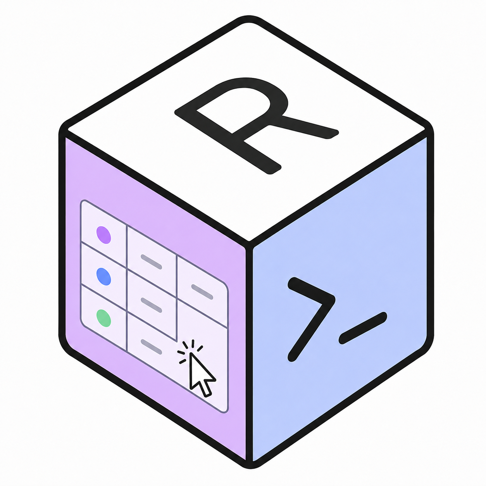

<p align="center">
  
</p>

# Rubien

Rubien is a native macOS reference manager built on one principle: **one library, two front doors.** A single local SQLite database holds every reference, tag, annotation, custom property, and view — and you reach it through either a Notion-style SwiftUI app for humans, or a scriptable `rubien-cli` for agents and automation. Both speak to the same store; neither is a second-class citizen. The icon — a cube whose faces are a Notion-style UI on one side and a terminal on the other — is the architecture in one image.

The SwiftUI app is Mac-only. `rubien-cli` also runs on Linux — see [Linux CLI](#linux-cli).

The name means *the keeper of borrowed knowledge.*

## Features

- **PDF reader + annotations** — native rendering with highlight / underline / anchored notes. Thumbnails, outline, full-text search. The Mac app reader uses PDFKit; CLI PDF tooling works on Mac (PDFKit) and Linux (poppler-glib).
- **Metadata fetching** — paste a DOI, arXiv ID, PMID, PMCID, ISBN, URL, or paper title. See [Supported sources](#supported-sources). No API keys.
- **FTS5 search** — SQLite full-text search across title, authors, journal, abstract, notes, DOI.
- **BibTeX / RIS import & export** — standard parsers, round-trip friendly.
- **iCloud sync** *(Mac only)* — `CKSyncEngine`-backed two-way sync of references, tags, annotations, custom properties, and views across Macs signed into the same iCloud account. Toggle in Settings → iCloud Sync.
- **CLI** — `rubien-cli` exposes everything as scriptable JSON. 18 subcommands on Mac, 17 on Linux (no `sync`). Tag operations live under `properties` against the built-in Tags property. Full reference in [`Docs/CLI-Reference.md`](Docs/CLI-Reference.md).

## MCP server

Rubien ships an MCP server (`rubien-mcp-server`) so Claude Code and claude.ai can manage your library through Claude:

```bash
claude mcp add rubien -- npx -y rubien-mcp-server
```

It wraps `rubien-cli` (bundled inside Rubien.app on macOS; a prebuilt binary on Linux — see below). See [`mcp-server/README.md`](mcp-server/README.md) for HTTP mode, the startup version guard, and the full tool catalog.

## Supported sources

Rubien adds references from:

- Any paper with a DOI (most academic journals)
- arXiv
- bioRxiv and medRxiv
- PubMed and PubMed Central (PMC)
- Books (by ISBN)
- Paper landing-page URLs from OpenReview, ACL Anthology, CVF Open Access, NeurIPS, PMLR, IEEE Xplore, ACM DL, Nature, Springer, and ScienceDirect (scraped via `citation_*` meta tags)
- Title search when you don't have an identifier

Paste a URL, an identifier, or a title — Rubien figures out the rest.

PDF auto-download works for arXiv, bioRxiv, medRxiv, any open-access paper with a DOI, and venue pages that expose `citation_pdf_url` (covers OpenReview, ACL, CVF, NeurIPS, PMLR — even when the paper has no DOI). Paywalled PDFs aren't fetched, but metadata and abstract still come through.

## Requirements

**For the app (Mac):**
- macOS 15 (Sequoia) or later to run
- Apple Silicon or Intel
- Xcode 16.3+ to build from source (GRDB 7.10 declares `swift-tools-version: 6.1`)

**For the CLI on Linux:** Swift 6.3+ toolchain and a few system libraries — see [Linux CLI](#linux-cli) below.

## Building (Mac)

```bash
# Run directly via SPM
swift run Rubien                    # the app
swift run rubien-cli list           # the CLI

# Run tests
swift test

# Build a distributable .app bundle + DMG
./scripts/build-app.sh              # Debug
./scripts/build-app.sh release      # Release
```

Build outputs land in `build/`: `Rubien.app` and `Rubien-{Debug,Release}.dmg`.

### Troubleshooting: stale SPM checkouts

If `swift build` / `swift run Rubien` suddenly fails with errors like `'grdb.swift': Source files for target CSQLite should be located under 'Sources/CSQLite'` or `'swift-argument-parser': invalid custom path 'Tools/generate-docc-reference'`, the Swift Package Manager checkout cache is corrupt — usually after switching the active developer toolchain (`sudo xcode-select -s ...`) between CommandLineTools and Xcode. Fix:

```bash
rm -rf .build .swiftpm
swift package resolve
swift run Rubien
```

This nukes the local package checkouts and SwiftPM state, then re-fetches cleanly.

## Linux CLI

`rubien-cli` builds and runs on Linux (x86_64 + arm64). The SwiftUI app and `RubienSync` (CloudKit) stay Mac-only — Linux gets 17 of the 18 CLI subcommands, everything except `sync`. PDF support (read text, render page images, extract metadata) comes via `RubienPDFKit`'s poppler-glib backend.

### Prebuilt binary

Download `rubien-cli-<version>-linux-x86_64.tar.gz` from the [latest release](https://github.com/devzhk/Rubien-releases/releases/latest) and extract it, **keeping `rubien-cli` and the `*.resources` folders together** — the CLI loads bundled citation styles via `Bundle.module` from beside the binary, so a bare-binary install breaks `styles`/`cite`:

```bash
# Runtime deps (Ubuntu 22.04+, glibc >= 2.35; x86_64)
sudo apt install -y libsqlite3-0 libcurl4 libxml2 libpoppler-glib8 libcairo2 libgdk-pixbuf-2.0-0 libglib2.0-0 ca-certificates

# Extract somewhere stable (binary + *.resources stay together)
mkdir -p ~/.local/rubien-cli && tar -xzf rubien-cli-*-linux-x86_64.tar.gz -C ~/.local/rubien-cli

# Point tools at it (or add the directory to PATH)
export RUBIEN_CLI=~/.local/rubien-cli/rubien-cli
```

Keep it current with `rubien-cli self-update` — it downloads the latest signed release and replaces itself in place after verifying an ed25519 signature. Prefer this over building from source unless you need a non-x86_64 build.

### Build from source

Build on Ubuntu 22.04 (or any distro with the Swift 6.3 toolchain):

```bash
# System deps
sudo apt-get install -y libsqlite3-dev libpoppler-glib-dev libcairo2-dev libgdk-pixbuf-2.0-dev pkg-config

# Release build (use for installation)
swift build --product rubien-cli -c release

# Install to /usr/local/bin so `rubien-cli` is on $PATH.
# Install the binary AND its resource bundles together — the CLI loads bundled
# citation styles via Bundle.module from beside the binary, so a bare-binary
# install breaks `styles`/`cite`.
sudo install -m 755 .build/release/rubien-cli /usr/local/bin/rubien-cli
sudo cp -r .build/release/*.resources /usr/local/bin/

# Or, if you prefer not to use sudo and have ~/bin on $PATH (copy the resource
# bundles into the same directory for the reason above).
install -m 755 .build/release/rubien-cli ~/bin/rubien-cli
cp -r .build/release/*.resources ~/bin/

# Verify
rubien-cli --help     # 17 subcommands; no `sync`
```

For local development iterate against the debug build at `.build/debug/rubien-cli` (rebuilt by `swift build --product rubien-cli` without `-c release`).

Library location on Linux: `$XDG_DATA_HOME/rubien/` (typically `~/.local/share/rubien/`). Override with `RUBIEN_LIBRARY_ROOT=...`.

See `Docs/Linux-PDF-Backend.md` if you're touching the Linux PDF backend.

## Data storage (Mac)

> Linux CLI library location is covered in the [Linux CLI](#linux-cli) section above — `~/.local/share/rubien/` by default, overridable with `RUBIEN_LIBRARY_ROOT`. The rest of this section is Mac-specific.

The signed Rubien.app stores all user data in its **App Group container** so the app and the bundled `rubien-cli` share a single library:

```
~/Library/Group Containers/9TXK4V3SS8.com.rubien.shared/Rubien/
```

This directory holds:

- `library.sqlite` (+ `-wal`, `-shm`) — references, tags, annotations, custom properties, views, sync bookkeeping
- `PDFs/` — imported PDF attachments
- `MetadataArtifacts/` — cached resolver responses
- `sync-engine-state.bin` — `CKSyncEngine` state sidecar (cursors, server change tags)

> **Back up this directory before any major version upgrade.** This is your library; nothing in `Application Support` or in iCloud's web UI is a substitute. Uninstalling the app bundle does **not** delete it.

Unsandboxed dev builds (`swift run Rubien`, `.build/debug/rubien-cli`) and any signed build whose App Group entitlement isn't honored fall back to `~/Library/Application Support/Rubien/`. The `RUBIEN_LIBRARY_ROOT` env var overrides the path explicitly.

> **Gotcha — two-library split.** The signed app (`./scripts/dev-launch.sh`) and the SPM dev app (`swift run Rubien`) read **two different libraries on the same Mac**. References you add in one won't appear in the other; iCloud sync is bound to the signed-app library only. Same applies to the two CLIs (bundled `Rubien.app/Contents/Helpers/rubien-cli` vs `.build/debug/rubien-cli`).
>
> The signed app and its bundled CLI **already** point at the App Group container — no env var needed. To force the **SPM dev builds** to read the same library, prefix the launch command:
>
> ```bash
> # SPM dev app, reading the signed-app library
> RUBIEN_LIBRARY_ROOT="$HOME/Library/Group Containers/9TXK4V3SS8.com.rubien.shared/Rubien" \
>   swift run Rubien
>
> # SPM dev CLI, reading the signed-app library
> RUBIEN_LIBRARY_ROOT="$HOME/Library/Group Containers/9TXK4V3SS8.com.rubien.shared/Rubien" \
>   .build/debug/rubien-cli list
> ```
>
> Or `export RUBIEN_LIBRARY_ROOT=...` once per terminal session if you'll be running several commands.

Window layout and other app preferences are stored in `~/Library/Preferences/com.rubien.app.plist` (sandboxed apps put it under `~/Library/Containers/com.rubien.app/Data/Library/Preferences/`).

## Project layout

```
Sources/
├── Rubien/                # App target (SwiftUI views, reader windows, resolver, SyncCoordinator) — Mac only
├── RubienCore/            # Shared library (models, GRDB, citation engine, metadata fetchers) — cross-platform
├── RubienPDFKit/          # PDF facade + Darwin (PDFKit) and Linux (poppler-glib) backends — cross-platform
├── RubienSync/            # CloudKit mapping layer + CKSyncEngine actor — Mac only
├── RubienCLI/             # rubien-cli command-line interface — cross-platform (sync subcommand Mac-only)
├── CPoppler/              # systemLibrary shim for libpoppler-glib + cairo (Linux only)
└── CGdkPixbuf/            # systemLibrary shim for libgdk-pixbuf-2.0 (Linux only)
Tests/
├── RubienCoreTests/
├── RubienSyncTests/
├── RubienTests/
├── RubienCLITests/
└── RubienPDFKitTests/      # Cross-backend parity (runs on Mac CI; Linux skips due to corelibs-xctest quirk)
scripts/
├── build-app.sh                    # Builds .app + DMG (Mac)
├── dev-launch.sh                   # Signs + launches with CloudKit entitlements (sync dev loop, Mac)
├── generate-pdf-fixtures.swift     # Regenerates Tests/RubienPDFKitTests/Fixtures (run-once on Mac)
└── run-linux-parity-tests.sh       # Per-test isolation wrapper for the Linux parity test path
```

## Attributions

**Bundled at runtime:**

| Component | License | Use |
|---|---|---|
| [GRDB.swift](https://github.com/groue/GRDB.swift) | MIT | SQLite ORM and reactive queries |
| [Readability.js](https://github.com/mozilla/readability) | Apache-2.0 | Web article extraction |
| [Defuddle](https://github.com/kepano/defuddle) | MIT | Web content cleaning |
| [citeproc-js](https://github.com/Juris-M/citeproc-js) | AGPL-3.0 | CSL renderer — bundled but currently unused |

**Linked dynamically against system packages on Linux** (not bundled, not redistributed):

| Component | License | Use |
|---|---|---|
| [poppler-glib](https://poppler.freedesktop.org) | GPL-2.0+ | PDF parsing + rendering in the Linux backend of `RubienPDFKit` |
| [cairo](https://www.cairographics.org) | LGPL-2.1 / MPL-1.1 | Image surface for `poppler_page_render` |
| [gdk-pixbuf](https://gitlab.gnome.org/GNOME/gdk-pixbuf) | LGPL-2.1+ | JPEG/PNG encoding of rendered page images |

citeproc-js (AGPL-3.0) ships in the resources tree but isn't called by any live code path; pure-Swift `CitationFormatter` and `CSLEngine` handle every citation today. AGPL would still apply to the bundled file on redistribution — revisit if you re-activate it.

Linux system libraries are linked dynamically against the user's distro packages — Rubien doesn't vendor or redistribute them.

Upstream: the original SwiftLib by [NickHood](https://github.com/NickHood1984/SwiftLib) included additional AGPL components (Zotero translation-server, translators_CN) which are not part of Rubien.
