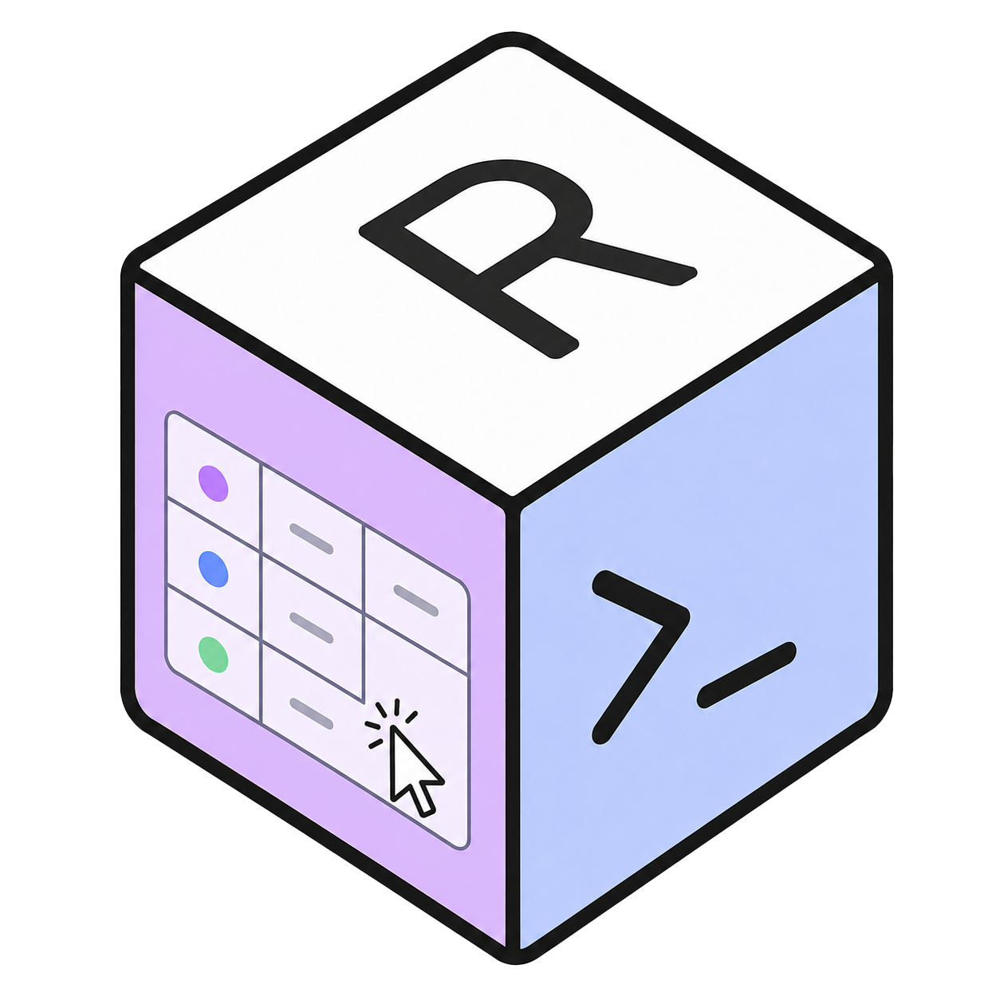
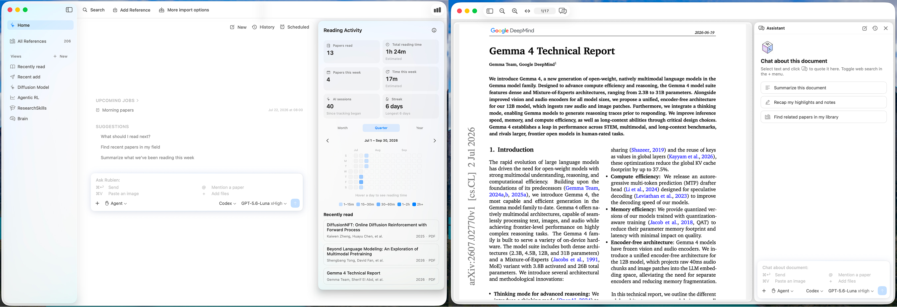

  

# Rubien

**A local-first, agentic research library.** Discover, read, and connect ideas in one library with the AI models you already use.

Rubien is a local research library with native readers for papers, books, and web sources. Its in-library assistant helps you discover new work, work through dense papers, connect ideas across sources, manage the library, and act through the tools available to your agent.

- [Download Rubien](https://github.com/devzhk/Rubien-releases/releases/latest).
  - Requires macOS 14.4+ and Apple Silicon; macOS 26.0 or later is recommended.
  - Requires Codex CLI or Claude Code CLI to drive the in-library assistant.

## Features

### In-library AI assistant

Your AI agent is available from Home or beside any open document. Rubien exposes clean context through standardized MCP tools to support tasks such as:

- Search the library: "Find papers on this topic in my library."
- Help with understanding: "Explain this section."
- Take notes: "Save our takeaways to Notion."
- Suggest what to read: "Recommend a paper based on my recent reading history."
- Run scheduled jobs: "Every weekday at 8 a.m., find new papers on my topic."

### Import with validation

For papers and books, Rubien validates publication metadata and imports from trusted publishers. For web sources such as blog posts and news articles, Rubien converts the content into clean Markdown.

Rubien supports various import options:

- Paste a DOI, arXiv ID, PMID, ISBN, paper URL, or bare title ([supported publishers and venues](Docs/Supported-Paper-URLs.md)).
- One click from your browser: the [Chrome extension](BrowserExtension/README.md) imports the paper, PDF, or article you're viewing.
- Ask the agent: describe what you're after and it finds and imports the references for you.
- Other options: import from Zotero, PDF file, or BibTeX file.

### Other

- Native PDF/web readers with highlights, underlines, and anchored notes.
- Track your reading activity and habits: reading streaks, an activity heatmap, and recent reads on Home.
- Organize your way: customizable columns in a database-style table, plus saved views with their own filters, sorts, and grouping.

### MCP server for your agent

Rubien ships the [rubien-mcp-server](https://www.npmjs.com/package/rubien-mcp-server), so you can access your library from any MCP client.
See [`mcp-server/README.md`](mcp-server/README.md) for more details.

## Development docs

- See [Building Rubien](Docs/Building.md) for app bundles, tests, troubleshooting, signed development builds, and the project layout.
- See [Linux CLI](Docs/Linux-CLI.md) for the command-line interface for Linux.
- See [Data storage and backups](Docs/Data-Storage.md) for how Rubien stores its library.

## Attributions

Rubien builds on these principal open-source projects:

| Component | License | Use |
|---|---|---|
| [GRDB.swift](https://github.com/groue/GRDB.swift) | MIT | SQLite ORM and reactive queries |
| [Sparkle](https://github.com/sparkle-project/Sparkle) | MIT | App updates |
| [Defuddle](https://github.com/kepano/defuddle) | MIT | Primary web-content extraction |
| [Mozilla Readability](https://github.com/mozilla/readability) | Apache-2.0 | Fallback web-content extraction |
| [SwiftLib](https://github.com/NickHood1984/SwiftLib) | MIT | Foundation adapted for parts of Rubien's interface, readers, and metadata importers |

## License

Rubien's first-party source code is available under the [Apache License 2.0](LICENSE), including the separately packaged [`mcp-server/`](mcp-server). Third-party components retain their original licenses; see [THIRD_PARTY_NOTICES](THIRD_PARTY_NOTICES) for copyright and license details.
